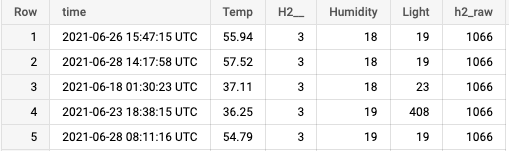
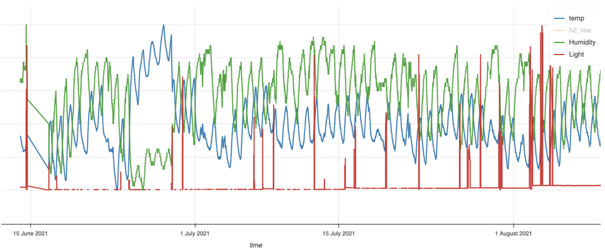

# Detect anomalies in real time using time series insight API

### Time Series Insight API is serverless and fully managed API and can be used for large scale forecasting and supports real time anomaly detection with low latency. It handles dataset consisting of billions of events and supports thousands of queries per second. Users can detect trends and anomalies with multiple event dimensions.

#### The notebooks in this repo go through end-to-end lifecyle of creating a new dataset, query it for anomaly detection and forecasting and different methods to interact with Time Series API

### Problem Desciption

In this demo, we will use an artificial tabular dataset (in time series format) to detect the anomalies across different dimension. The dataset consists of few dimensions and each row in the dataset represents an event which is real time stream coming from a sensor. Each sensor event is a reading from a physical room containing the temperature, humidity, light and hydrogen value. The data is streamed every 23 seconds or so. In total, dataset has approximately 202K rows for 2 months readings. 

We will use this datase with `Time Series Insight API` to detect anomalies using dimension temperature and light values.

### Setup 

- Enable Time Series API
    - Google Cloud Console > API Library Page > Time Series API
        ``` 
            gcloud services enable timeseriesinsights.googleapis.com
        ``` 
- Set up authentication
    - Create a `service account`
        ```
            gcloud iam service-accounts create <SERVICE_ACCOUNT_ID> \
            --description="DESCRIPTION" \
            --display-name="DISPLAY_NAME"
        ```
    - Grant service account `Timeseries Insights DataSet Owner` role
        ```
            gcloud projects add-iam-policy-binding "${PROJECT_ID}" --member="serviceAccount:${SVC_ACCOUNT}"  \
            --role=roles/timeseriesinsights.datasetsOwner 
        ```
        
### Dataset

As mentioned in the problem descrition, we have used an artificial dataset containing the few dimensions for each event. Some sample rows from the dataset looks like below. This is a table in the Bigquery



Here are the values for each dimension change over time



We will use this data to perform anonmaly detection on dimesion `Temperature` and `Light`. But first, we will need to convert this tabular data into another jsonl form so that API can consume it. Because all these data dimensions are of numerical value, it is important for our use case to insert a “dummy” categorical string based dimension on our data, so that we could query on that “slice”. Currently, the only way to create a dataset is from a Cloud Storage object. This Cloud Storage object must be a JSON file with all the event data as a JSON object with each data point on a new line (this is sometimes known as JSONL). The data must also be structured in the form the API is expecting for an event which can be seen [here](https://cloud.google.com/timeseries-insights/docs/reference/rest/v1/projects.datasets/appendEvents#Event).


The converted jsonl event looks like below:

        
            { "groupId":"2583958225776393023",
                "eventTime":"2021-06-14T00:00:04+00:00",
                "Dimensions":[
                    {"name":"measure","stringVal":"LTTH"},
                    {"name":"Humidity","doubleVal":36},
                    {"name":"Light","doubleVal":99},
                    {"name":"h2_raw","doubleVal":1041},
                    {"name":"temp","doubleVal":36.97}
            ]}
        

### Dataset Inspection and API Methods

The Time Series API has four main methods that users can used to interact with API and used for forecasting and anomaly detection:

- **Creating dataset**

The first step is to create a dataset that you can query for anomaly or forecasting. A jsonl file with events stored in a cloud storage can be used to create datset in time series api. Once all the data was converted and stored in a Cloud Storage bucket, we loaded the dataset by sending a create request to the API. 

A sample of our JSON payload sent to the API looks like this:

        
            file_data = {
                           "name": "test", #alter this as more testing is done
                           "ttl": "30000000s",
                           "dataNames": [
                               "measure",
                               "Humidity",
                               "Light",
                               "h2_raw",
                               "temp",
                           ],
                           "dataSources": [
                               {"uri": "gs://[GCP_BUCKET]/[JSON_FILE].json"} #sample of data in Cloud Storage JSON file
                               ],
                        }
        
Before attempting to append events to a dataset or query it, it is important to make a GET call to the API to [list](https://cloud.google.com/timeseries-insights/docs/reference/rest/v1/projects.datasets/list) the current datasets under your GCP Project. It may take a while  before your dataset is loaded and ready for analysis depending on how big is your dataset


- **List and Query dataset**

List method can be used to list all the dataset that exists in Time Series API and Query method is used for querying for anomalies. Our goal is to be able to detect time series anomalies in real time, so we simulate querying the timestamp that was most recently appended. We did this by calling the [query endpoint](https://cloud.google.com/timeseries-insights/docs/reference/rest/v1/projects.datasets/query), which only accepts a specific request body that can be found in the documentation. The request alters what kind of time series is returned, and how it returns. It includes several ways to construct and evaluate the time series, with different time series parameters and forecast parameters such as granularity and history, which can be read more about in the documentation.


Here’s an example of our query request:


        
            request_body = {
               "detectionTime": "2022-04-20T00:35:20Z", #Input the date of a timestamp that was appneded to your dataset.
               "slicingParams": {
                   "dimensionNames": ["measure"]
                   },
               "timeseriesParams": {
                   "forecastHistory": "43000s",
                   "granularity": "450s",
                   "metric": "temp"
                   },
               "forecastParams": {
                   "sensitivity": 0.90,
                   "noiseThreshold": 12.0,
                   "seasonalityHint": "DAILY"
                   },

               "returnNonAnomalies": "true",
               "returnTimeseries": "true"
                    }
        
     
Notice that our slicing parameter is the dummy categorical value, since our data is one dimensional and the API requires we query against a slice.

You can look at the result by calling API endpoint using query method to see the forecsted value and the anomaly point. Below is the sample output for query method that shows the anomaly at detection point:

        
                {'name': 'projects/nishitp-daml/datasets/jbl_timeseries_full',
                     'anomalyDetectionResult': {'anomalies': [{'dimensions': [{'name': 'measure',
                          'stringVal': 'LTTH'}],
                        'result': {'holdoutErrors': {'mdape': 0.013989500224642598,
                          'rmd': 0.015349178656558816},
                         'trainingErrors': {'mdape': 0.011671908857898617,
                          'rmd': 0.013851399067049623},
                         'forecastStats': {'density': '100', 'numAnomaliesInHoldout': 3},
                         'history': {'point': [{'time': '2021-06-23T15:00:00Z',
                                'value': 2621.5630000000006},
                               {'time': '2021-06-23T15:30:00Z', 'value': 2619.303},
                               {'time': '2021-06-23T16:00:00Z', 'value': 2676.1319999999996},
                               {'time': '2021-06-23T16:30:00Z', 'value': 2714.2309999999998},
                               {'time': '2021-06-23T17:00:00Z', 'value': 2759.1},
                               {'time': '2021-06-23T17:30:00Z', 'value': 2776.8510000000006},
                               {'time': '2021-06-23T18:00:00Z', 'value': 2759.0220000000004},
                               {'time': '2021-06-23T18:30:00Z', 'value': 2740.361},
                               {'time': '2021-06-23T19:00:00Z', 'value': 2697.5130000000004},
                               {'time': '2021-06-23T19:30:00Z', 'value': 2838.39},
                               {'time': '2021-06-23T20:00:00Z', 'value': 2892.5299999999997},
                               {'time': '2021-06-23T20:30:00Z', 'value': 2899.383},
                               {'time': '2021-06-23T21:00:00Z', 'value': 2975.749},
                               {'time': '2021-06-23T21:30:00Z', 'value': 3070.368},
                               {'time': '2021-06-23T22:00:00Z', 'value': 3109.6609999999996},
                               {'time': '2021-06-23T22:30:00Z', 'value': 3163.771},
                               {'time': '2021-06-23T23:00:00Z', 'value': 3135.3119999999994},
                               {'time': '2021-06-23T23:30:00Z', 'value': 3147.5249999999996},
                               {'time': '2021-06-24T00:00:00Z', 'value': 3115.2509999999997},
                               {'time': '2021-06-24T00:30:00Z', 'value': 2997.509},
                               {'time': '2021-06-24T01:00:00Z', 'value': 2868.843},
                               {'time': '2021-06-24T01:30:00Z', 'value': 2766.941},
                               {'time': '2021-06-24T02:00:00Z', 'value': 2678.9410000000003},
                               {'time': '2021-06-24T02:30:00Z', 'value': 2587.813},
                               {'time': '2021-06-24T03:00:00Z', 'value': 2530.803},
                               {'time': '2021-06-24T03:30:00Z', 'value': 2474.0140000000006},
                               {'time': '2021-06-24T04:00:00Z', 'value': 2428.445},
                               {'time': '2021-06-24T04:30:00Z', 'value': 2379.9539999999997},
                               {'time': '2021-06-24T05:00:00Z', 'value': 2370.118},
                               {'time': '2021-06-24T05:30:00Z', 'value': 2295.153},
                               {'time': '2021-06-24T06:00:00Z', 'value': 2245.147},
                               {'time': '2021-06-24T06:30:00Z', 'value': 2207.106},
                               {'time': '2021-06-24T07:00:00Z', 'value': 2177.697},
                               {'time': '2021-06-24T07:30:00Z', 'value': 2161.187},
                               {'time': '2021-06-24T08:00:00Z', 'value': 2149.0550000000003},
                               {'time': '2021-06-24T08:30:00Z', 'value': 2135.6},
                               {'time': '2021-06-24T09:00:00Z', 'value': 2105.095},
                               {'time': '2021-06-24T09:30:00Z', 'value': 2088.887},
                               {'time': '2021-06-24T10:00:00Z', 'value': 2093.605},
                               {'time': '2021-06-24T10:30:00Z', 'value': 2100.736},
                               {'time': '2021-06-24T11:00:00Z', 'value': 2121.2940000000003},
                               {'time': '2021-06-24T11:30:00Z', 'value': 2137.089},
                               {'time': '2021-06-24T12:00:00Z', 'value': 2182.868},
                               {'time': '2021-06-24T12:30:00Z', 'value': 2271.6549999999997},
                               {'time': '2021-06-24T13:00:00Z', 'value': 2379.0440000000003},
                               {'time': '2021-06-24T13:30:00Z', 'value': 2484.435},
                               {'time': '2021-06-24T14:00:00Z', 'value': 2471.913},
                               {'time': '2021-06-24T14:30:00Z', 'value': 2748.581},
                               {'time': '2021-06-24T15:00:00Z', 'value': 2995.938},
                               {'time': '2021-06-24T15:30:00Z', 'value': 3180.4890000000005},
                               {'time': '2021-06-24T16:00:00Z', 'value': 3330.4880000000003},
                               {'time': '2021-06-24T16:30:00Z', 'value': 3468.05},
                               {'time': '2021-06-24T17:00:00Z', 'value': 3583.2000000000007},
                               {'time': '2021-06-24T17:30:00Z', 'value': 3672.818},
                               {'time': '2021-06-24T18:00:00Z', 'value': 3744.326},
                               {'time': '2021-06-24T18:30:00Z', 'value': 3813.5840000000003},
                               {'time': '2021-06-24T19:00:00Z', 'value': 3624.1510000000003},
                               {'time': '2021-06-24T19:30:00Z', 'value': 3935.7479999999996},
                               {'time': '2021-06-24T20:00:00Z', 'value': 3978.758},
                               {'time': '2021-06-24T20:30:00Z', 'value': 4022.648},
                               {'time': '2021-06-24T21:00:00Z', 'value': 4063.9759999999997},
                               {'time': '2021-06-24T21:30:00Z', 'value': 4103.834},
                               {'time': '2021-06-24T22:00:00Z', 'value': 4141.076},
                               {'time': '2021-06-24T22:30:00Z', 'value': 4171.952},
                               {'time': '2021-06-24T23:00:00Z', 'value': 4206.507},
                               {'time': '2021-06-24T23:30:00Z', 'value': 4226.311},
                               {'time': '2021-06-25T00:00:00Z', 'value': 4172.781},
                               {'time': '2021-06-25T00:30:00Z', 'value': 4085.0130000000004},
                               {'time': '2021-06-25T01:00:00Z', 'value': 4013.528},
                               {'time': '2021-06-25T01:30:00Z', 'value': 3981.507},
                               {'time': '2021-06-25T02:00:00Z', 'value': 3955.6070000000004},
                               {'time': '2021-06-25T02:30:00Z', 'value': 3906.605},
                               {'time': '2021-06-25T03:00:00Z', 'value': 3846.047},
                               {'time': '2021-06-25T03:30:00Z', 'value': 3796.774},
                               {'time': '2021-06-25T04:00:00Z', 'value': 3758.1760000000004},
                               {'time': '2021-06-25T04:30:00Z', 'value': 3725.004},
                               {'time': '2021-06-25T05:00:00Z', 'value': 3692.648},
                               {'time': '2021-06-25T05:30:00Z', 'value': 3660.112},
                               {'time': '2021-06-25T06:00:00Z', 'value': 3633.4080000000004},
                               {'time': '2021-06-25T06:30:00Z', 'value': 3610.912},
                               {'time': '2021-06-25T07:00:00Z', 'value': 3592.749},
                               {'time': '2021-06-25T07:30:00Z', 'value': 3568.846},
                               {'time': '2021-06-25T08:00:00Z', 'value': 3548.341},
                               {'time': '2021-06-25T08:30:00Z', 'value': 3508.312},
                               {'time': '2021-06-25T09:00:00Z', 'value': 3470.567},
                               {'time': '2021-06-25T09:30:00Z', 'value': 3436.946},
                               {'time': '2021-06-25T10:00:00Z', 'value': 3408.5269999999996},
                               {'time': '2021-06-25T10:30:00Z', 'value': 3391.9130000000005},
                               {'time': '2021-06-25T11:00:00Z', 'value': 3410.7000000000003},
                               {'time': '2021-06-25T11:30:00Z', 'value': 3450.026},
                               {'time': '2021-06-25T12:00:00Z', 'value': 3515.5490000000004},
                               {'time': '2021-06-25T12:30:00Z', 'value': 3603.8080000000004},
                               {'time': '2021-06-25T13:00:00Z', 'value': 3692.387},
                               {'time': '2021-06-25T13:30:00Z', 'value': 3773.9770000000003},
                               {'time': '2021-06-25T14:00:00Z', 'value': 3853.6789999999996},
                               {'time': '2021-06-25T14:30:00Z', 'value': 3923.5869999999995},
                               {'time': '2021-06-25T15:00:00Z', 'value': 3977.254},
                               {'time': '2021-06-25T15:30:00Z', 'value': 4009.248},
                               {'time': '2021-06-25T16:00:00Z', 'value': 4024.299},
                               {'time': '2021-06-25T16:30:00Z', 'value': 4040.986},
                               {'time': '2021-06-25T17:00:00Z', 'value': 4076.268},
                               {'time': '2021-06-25T17:30:00Z', 'value': 4104.407},
                               {'time': '2021-06-25T18:00:00Z', 'value': 4120.543},
                               {'time': '2021-06-25T18:30:00Z', 'value': 4146.393},
                               {'time': '2021-06-25T19:00:00Z', 'value': 4178.787},
                               {'time': '2021-06-25T19:30:00Z', 'value': 4210.8060000000005},
                               {'time': '2021-06-25T20:00:00Z', 'value': 4245.712},
                               {'time': '2021-06-25T20:30:00Z', 'value': 4275.331},
                               {'time': '2021-06-25T21:00:00Z', 'value': 4296.538},
                               {'time': '2021-06-25T21:30:00Z', 'value': 4301.097},
                               {'time': '2021-06-25T22:00:00Z', 'value': 4299.954},
                               {'time': '2021-06-25T22:30:00Z', 'value': 4319.204},
                               {'time': '2021-06-25T23:00:00Z', 'value': 4345.275},
                               {'time': '2021-06-25T23:30:00Z', 'value': 4326.514},
                               {'time': '2021-06-26T00:00:00Z', 'value': 4273.577},
                               {'time': '2021-06-26T00:30:00Z', 'value': 4212.924000000001},
                               {'time': '2021-06-26T01:00:00Z', 'value': 4156.523},
                               {'time': '2021-06-26T01:30:00Z', 'value': 4116.795999999999},
                               {'time': '2021-06-26T02:00:00Z', 'value': 4081.7960000000003},
                               {'time': '2021-06-26T02:30:00Z', 'value': 4049.9660000000003},
                               {'time': '2021-06-26T03:00:00Z', 'value': 4021.977},
                               {'time': '2021-06-26T03:30:00Z', 'value': 4048.076},
                               {'time': '2021-06-26T04:00:00Z', 'value': 3968.908},
                               {'time': '2021-06-26T04:30:00Z', 'value': 3948.3560000000007},
                               {'time': '2021-06-26T05:00:00Z', 'value': 3927.415},
                               {'time': '2021-06-26T05:30:00Z', 'value': 3909.362},
                               {'time': '2021-06-26T06:00:00Z', 'value': 3895.704},
                               {'time': '2021-06-26T06:30:00Z', 'value': 3883.077},
                               {'time': '2021-06-26T07:00:00Z', 'value': 3882.556},
                               {'time': '2021-06-26T07:30:00Z', 'value': 3893.3179999999998},
                               {'time': '2021-06-26T08:00:00Z', 'value': 3891.4440000000004},
                               {'time': '2021-06-26T08:30:00Z', 'value': 3894.424},
                               {'time': '2021-06-26T09:00:00Z', 'value': 3896.44},
                               {'time': '2021-06-26T09:30:00Z', 'value': 3953.66},
                               {'time': '2021-06-26T10:00:00Z', 'value': 3901.0450000000005},
                               {'time': '2021-06-26T10:30:00Z', 'value': 3907.5450000000005},
                               {'time': '2021-06-26T11:00:00Z', 'value': 3929.015},
                               {'time': '2021-06-26T11:30:00Z', 'value': 3968.4779999999996},
                               {'time': '2021-06-26T12:00:00Z', 'value': 4018.1389999999997},
                               {'time': '2021-06-26T12:30:00Z', 'value': 4077.706},
                               {'time': '2021-06-26T13:00:00Z', 'value': 4134.648},
                               {'time': '2021-06-26T13:30:00Z', 'value': 4171.783},
                               {'time': '2021-06-26T14:00:00Z', 'value': 4189.647},
                               {'time': '2021-06-26T14:30:00Z', 'value': 4216.937},
                               {'time': '2021-06-26T15:00:00Z', 'value': 4262.166}]},
                             'forecast': {'point': [{'time': '2021-06-26T15:00:00Z',
                                'value': 4101.920438380789}]},
                             'detectionPointActual': 4262.166,
                             'detectionPointForecast': 4101.920438380789,
                             'detectionPointForecastLowerBound': 4018.194767943912,
                             'detectionPointForecastUpperBound': 4185.646108817666},
            'status': {}}]}}
        

- **Append Streaming updates**

Once the dataset is loaded, you can begin to append your event data in real time. It is important to remember that when [appending](https://cloud.google.com/timeseries-insights/docs/reference/rest/v1/projects.datasets/appendEvents) an event, it is important to remember the fourth note in the [request body documentation](https://cloud.google.com/timeseries-insights/docs/reference/rest/v1/projects.datasets/appendEvents#request-body),  which states that the events being appended must newer than the current time minus the [DataSet TLL](https://cloud.google.com/timeseries-insights/docs/reference/rest/v1/projects.datasets#DataSet.FIELDS.ttl), which is a parameter set when creating a dataset that determines how long the dataset data should be stored for before being discarded. Essentially, depending on your TTL, you can’t really test this API by trying to append historical data (at least if the timestamp is far in the past).

Once your recent data is ready to be appended, all you have to do is simply call the [appendEvents endpoint](https://cloud.google.com/timeseries-insights/docs/reference/rest/v1/projects.datasets/appendEvents) of your specific dataset with a POST request and your event data in the JSON format above in our sample event data. The response to this request is simply an empty string.  


- **Delete timeseries**

Using delete methos, users can delete an existing dataset from the Time Series API. 


